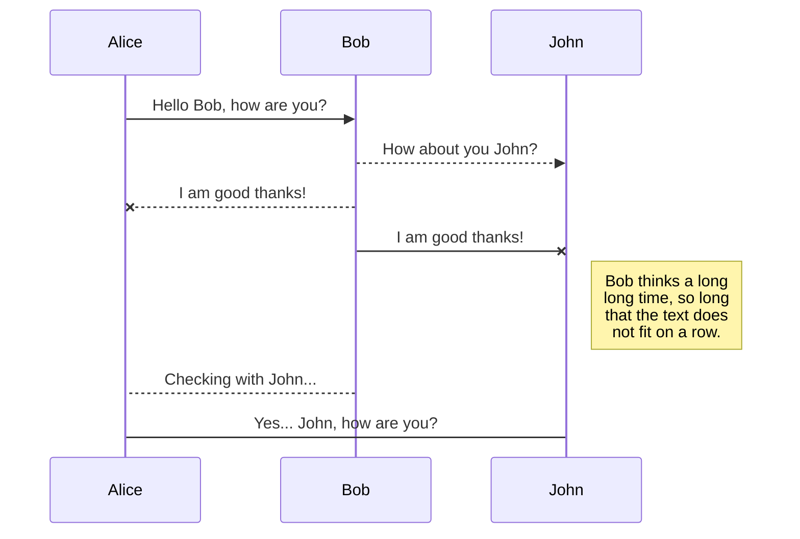
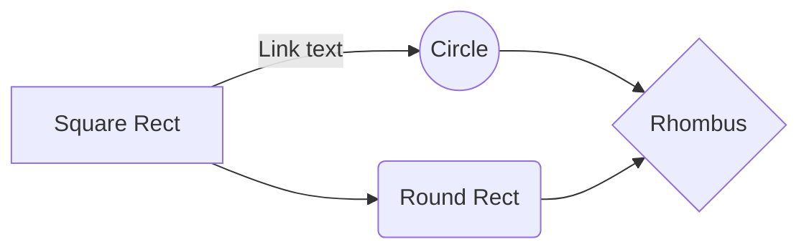

# Alibaba Cloud BigData Pipeline 구축하기

## 소개글 
알리바바는 Aliexpress, Tmall 등 중국의 e-commerce 플랫폼에서 시작하여 현재는 많은 아시아권 나라에서 다양한 비즈니스를 수행하고 있습니다. 아시아는 세계에서 가장 높은 인구 분포를 지니고 있는데요. 오늘날 세계 인구 70억명 중 4/7에 이르는 40억명이 중동을 포함한 아시아에서 살고 있다고 합니다. 이는 아시아에서 우세한 비즈니스를 하고 있는 알리바바가 그만큼 많은 데이터를 보유하고 있다는 점을 시사합니다. 

알리바바 클라우드에서 제공하는 모든 BigData 관련 서비스는 모두 AliPay, AliExpress, Tmall, Taobao 등 알리바바 비즈니스의 주축을 이루는 모든 계열사의 데이터 분석에서 실제로 활용되고 있는 서비스입니다. 가령, 2019년 11월 11일 중국의 최대 쇼핑페스티벌인 광군제에서는 하루에 1.7EB 의 데이터를 알리바바 클라우드의 BigData Platform에서 처리를 했고, 실시간 데이터 처리엔진인 RealTime Compute(Flink)는 피크타임 시 초당 40억개의 데이터를 consume하여 처리한 바 있습니다.

As shown in the preceding figure, based on the real-time computing platform of Flink, Alibaba processed 4 billion messages with a total data volume of 7TB during the 2020 Double 11. It also created 580,000 orders per second with the computing scale exceeding 1.5 million cores.

제 개인적인 생각으로도 알리바바 클라우드는 빅데이터 처리 쪽에서 강점을 가지고 있다고 생각합니다. 여러 PoC를 진행하며 놀라운 성능을 직접 목격하였고 데이터 개발 및 파이프라인을 구축하는데 괜찮은 Tool도 보유하고 있습니다.  - 뺄까 말까 생각중..

## 알리바바 클라우드 빅데이터 서비스
자, 그럼 본격적으로 알리바바 클라우드의 BigData Service에 대해서 알아보도록 하겠습니다. 
[알리바바 클라우드 공식 문서 사이트](https://www.alibabacloud.com/help?spm=a2c63.p38356.879954.1.3cd95ec1KElTo8)에 가보시면, Big Data와 Databases 섹터에 다양한 서비스가 있는 것을 확인하실 수 있습니다. 

때로는 서비스가 너무 많아서 어떤 서비스를 선택해야할지 막막하시리라 생각합니다. 비슷해 보이는, 중첩된 기능을 제공하는 서로 다른 서비스가 있는가 하면, 서비스를 들어가 적용 시나리오를 읽다보면 이것 저것 다 유용해 보이기도 합니다. 

# Files

StackEdit stores your files in your browser, which means all your files are automatically saved locally and are accessible **offline!**

## Create files and folders

The file explorer is accessible using the button in left corner of the navigation bar. You can create a new file by clicking the **New file** button in the file explorer. You can also create folders by clicking the **New folder** button.

## Switch to another file

All your files and folders are presented as a tree in the file explorer. You can switch from one to another by clicking a file in the tree.

## Rename a file

You can rename the current file by clicking the file name in the navigation bar or by clicking the **Rename** button in the file explorer.

## Delete a file

You can delete the current file by clicking the **Remove** button in the file explorer. The file will be moved into the **Trash** folder and automatically deleted after 7 days of inactivity.

## Export a file

You can export the current file by clicking **Export to disk** in the menu. You can choose to export the file as plain Markdown, as HTML using a Handlebars template or as a PDF.

# Synchronization

Synchronization is one of the biggest features of StackEdit. It enables you to synchronize any file in your workspace with other files stored in your **Google Drive**, your **Dropbox** and your **GitHub** accounts. This allows you to keep writing on other devices, collaborate with people you share the file with, integrate easily into your workflow... The synchronization mechanism takes place every minute in the background, downloading, merging, and uploading file modifications.

There are two types of synchronization and they can complement each other:

- The workspace synchronization will sync all your files, folders and settings automatically. This will allow you to fetch your workspace on any other device.
	> To start syncing your workspace, just sign in with Google in the menu.

- The file synchronization will keep one file of the workspace synced with one or multiple files in **Google Drive**, **Dropbox** or **GitHub**.
	> Before starting to sync files, you must link an account in the **Synchronize** sub-menu.

## Open a file

You can open a file from **Google Drive**, **Dropbox** or **GitHub** by opening the **Synchronize** sub-menu and clicking **Open from**. Once opened in the workspace, any modification in the file will be automatically synced.

## Save a file

You can save any file of the workspace to **Google Drive**, **Dropbox** or **GitHub** by opening the **Synchronize** sub-menu and clicking **Save on**. Even if a file in the workspace is already synced, you can save it to another location. StackEdit can sync one file with multiple locations and accounts.

## Synchronize a file

Once your file is linked to a synchronized location, StackEdit will periodically synchronize it by downloading/uploading any modification. A merge will be performed if necessary and conflicts will be resolved.

If you just have modified your file and you want to force syncing, click the **Synchronize now** button in the navigation bar.

> **Note:** The **Synchronize now** button is disabled if you have no file to synchronize.

## Manage file synchronization

Since one file can be synced with multiple locations, you can list and manage synchronized locations by clicking **File synchronization** in the **Synchronize** sub-menu. This allows you to list and remove synchronized locations that are linked to your file.

# Publication

Publishing in StackEdit makes it simple for you to publish online your files. Once you're happy with a file, you can publish it to different hosting platforms like **Blogger**, **Dropbox**, **Gist**, **GitHub**, **Google Drive**, **WordPress** and **Zendesk**. With [Handlebars templates](http://handlebarsjs.com/), you have full control over what you export.

> Before starting to publish, you must link an account in the **Publish** sub-menu.

## Publish a File

You can publish your file by opening the **Publish** sub-menu and by clicking **Publish to**. For some locations, you can choose between the following formats:

- Markdown: publish the Markdown text on a website that can interpret it (**GitHub** for instance),
- HTML: publish the file converted to HTML via a Handlebars template (on a blog for example).

## Update a publication

After publishing, StackEdit keeps your file linked to that publication which makes it easy for you to re-publish it. Once you have modified your file and you want to update your publication, click on the **Publish now** button in the navigation bar.

> **Note:** The **Publish now** button is disabled if your file has not been published yet.

## Manage file publication

Since one file can be published to multiple locations, you can list and manage publish locations by clicking **File publication** in the **Publish** sub-menu. This allows you to list and remove publication locations that are linked to your file.

# Markdown extensions

StackEdit extends the standard Markdown syntax by adding extra **Markdown extensions**, providing you with some nice features.

> **ProTip:** You can disable any **Markdown extension** in the **File properties** dialog.

## SmartyPants

SmartyPants converts ASCII punctuation characters into "smart" typographic punctuation HTML entities. For example:

|                |ASCII                          |HTML                         |
|----------------|-------------------------------|-----------------------------|
|Single backticks|`'Isn't this fun?'`            |'Isn't this fun?'            |
|Quotes          |`"Isn't this fun?"`            |"Isn't this fun?"            |
|Dashes          |`-- is en-dash, --- is em-dash`|-- is en-dash, --- is em-dash|

## KaTeX

You can render LaTeX mathematical expressions using [KaTeX](https://khan.github.io/KaTeX/):

The *Gamma function* satisfying $\Gamma(n) = (n-1)!\quad\forall n\in\mathbb N$ is via the Euler integral

$$
\Gamma(z) = \int_0^\infty t^{z-1}e^{-t}dt\,.
$$

> You can find more information about **LaTeX** mathematical expressions [here](http://meta.math.stackexchange.com/questions/5020/mathjax-basic-tutorial-and-quick-reference).

## UML diagrams

You can render UML diagrams using [Mermaid](https://mermaidjs.github.io/). For example, this will produce a sequence diagram:

And this will produce a flow chart:

<!--stackedit_data:
eyJoaXN0b3J5IjpbLTMxNDYwNzQ4OCwxMDkwMjAwNjk4LC0xMT
E1MjU4NTIzLC0zNzAxMDcyMTNdfQ==
-->